<div align="center">



<br/>

<a href="https://www.muhammadsameer.de"></a>
&nbsp;
<a href="https://www.linkedin.com/in/mirzasameerbaig99/"></a>
&nbsp;
<a href="https://www.xing.com/profile/Muhammad_Sameer033677"></a>
&nbsp;
<a href="mailto:sameermubasher99@gmail.com"></a>
&nbsp;
<a href="https://github.com/mirzasameer2000?tab=repositories"></a>

</div>

<br/>

## About

I build AI systems end to end — from data pipelines and model training through to APIs and deployed services.

Right now I'm a **Full Stack AI Developer at AI Agency** in Budapest, working across a Hungarian legal platform and leading development on a new legal PWA. Before that I spent 16 months at **Della.hu** building a production LLM orchestration layer over 10+ AI providers.

I'm finishing an **MSc in Data Science** in Berlin, where my dissertation applies ML and DL to large real-world atmospheric and flight datasets.

```python
class MuhammadSameer:
    role     = "Full Stack AI Developer"
    location = "Berlin, Germany"
    studying = "MSc Data Science"
    focus    = ["LLM systems", "backend architecture", "data pipelines"]

    def currently(self) -> list[str]:
        return [
            "Leading a Hungarian legal PWA end to end",
            "Shipping contract lifecycle + e-invoicing systems",
            "Writing a dissertation on atmospheric & flight data",
        ]
```

<br/>

<div align="center">
  
</div>

<br/>

## Experience

<details open>
<summary><b>&nbsp;AI Agency</b> &nbsp;—&nbsp; Full Stack AI Developer &nbsp;&nbsp;<code>Jan 2026 — Present</code></summary>

<br/>

<table>
<tr>
<td width="130"><b>Location</b></td>
<td>Budapest, Hungary &nbsp;·&nbsp; Remote</td>
</tr>
<tr>
<td><b>Focus</b></td>
<td>Legal tech platform · Delivery leadership · Infrastructure</td>
</tr>
</table>

**Full stack — legal platform**

- Built a complete **contract lifecycle system** — filters, draft flow, chat, review and acceptance, witness handling, per-party signing (DocuSign, eSigno), expiry, versioning, and a full audit log
- Integrated **Számlázz.hu** e-invoicing end to end: draft/confirm lifecycle, three billing scenarios, WeasyPrint PDF invoices, NAV tax reporting
- **File conversion services** — HTML→PDF via Playwright, PDF→DOCX via LibreOffice, running in Railway containers
- React frontend for contract review, signing modals, timeline, and notifications, with bilingual EN/HU handling

**Lead developer — new legal PWA**

- Coordinate a small team of backend and frontend developers
- Own the delivery pipeline: Trello tickets across sprints, milestones, code review, deploys
- Define backend architecture, API contracts, and integration patterns for **ID card OCR**, **Deal Room**, and an **AI Term Sheet Generator**

**DevOps**

- Deployed and stabilized on **Railway** — custom domains, PostgreSQL, Redis, MongoDB Atlas, Celery, Cloudflare R2, Mailgun
- Automated **Electron** desktop builds via GitHub Actions matrix (Windows, macOS, Linux)

<sub>`Python` · `Django` · `DRF` · `PostgreSQL` · `MongoDB` · `Redis` · `Celery` · `React` · `Vite` · `Railway` · `Cloudflare R2` · `GitHub Actions`</sub>

</details>

<details>
<summary><b>&nbsp;Della.hu</b> &nbsp;—&nbsp; Django Backend Developer &nbsp;&nbsp;<code>Sep 2024 — Dec 2025</code></summary>

<br/>

<table>
<tr>
<td width="130"><b>Location</b></td>
<td>Budapest, Hungary &nbsp;·&nbsp; Remote</td>
</tr>
<tr>
<td><b>Focus</b></td>
<td>AI orchestration · Backend APIs · Data pipelines</td>
</tr>
</table>

Primary developer on the AI division of a student employment platform.

- **Unified backend proxy** integrating 10+ AI providers — OpenAI, Gemini, Google Veo 2/3, ElevenLabs, Runway, Suno, Midjourney, Ideogram, Bitstudio, Tengr.ai — with shared logging, throttling, and admin/user endpoints
- RESTful APIs with authentication, input validation, and consistent error handling across every integration
- **Celery** async tasks and background workers for long-running AI generation jobs, with retry and rate-limit guards
- Mini **ETL pipelines** with Pandas and SQLAlchemy for ingestion and modeling
- Twilio SMS and Mailgun email flows; MongoDB Atlas for logging and analytics

<sub>`Python` · `Django` · `DRF` · `PostgreSQL` · `MongoDB` · `Redis` · `Celery` · `Pandas` · `SQLAlchemy`</sub>

</details>

<details>
<summary><b>&nbsp;Digital Billing Services</b> &nbsp;—&nbsp; IT Support Intern &nbsp;&nbsp;<code>Sep 2022 — Dec 2022</code></summary>

<br/>

<table>
<tr>
<td width="130"><b>Location</b></td>
<td>Lahore, Pakistan &nbsp;·&nbsp; On-site</td>
</tr>
</table>

- Excel-based operational reporting and documentation
- Troubleshooting support for software, connectivity, and setup issues
- Networking fundamentals with Cisco Packet Tracer; Windows Server lab work

</details>

<br/>

## Selected Work

<details>
<summary><b>Machine Learning & AI</b></summary>

<br/>

| Project | What it does |
| :--- | :--- |
| [**MedAI**](https://github.com/mirzasameer2000/MedAI-A-COVID-19-Smoking-Medical-Chatbot) | COVID-19 and smoking medical chatbot built on a curated medical corpus |
| [**DigitMind**](https://github.com/mirzasameer2000/DigitMind-Neural-Network-Digit-Recognition-Explorer) | Neural net digit recognition that measures how activation choices affect accuracy and generalization |
| [**RL in Unity**](https://github.com/mirzasameer2000/Advanced-Reinforcement-Learning-in-Unity---PPO-Ray-Perception-Goal-Seeking-Agent) | PPO agent with ray perception, goal-seeking in a Unity environment |
| [**Flight Price Predictor**](https://github.com/mirzasameer2000/flight-price-predictor) | Regression pipeline on real flight pricing data |
| [**ML Projects**](https://github.com/mirzasameer2000/Machine-Learning-Projects) | Preprocessing, model building, evaluation, and deployment across real-world datasets |

</details>

<details>
<summary><b>Data & Visualization</b></summary>

<br/>

| Project | What it does |
| :--- | :--- |
| [**Data Visualization Methods**](https://github.com/mirzasameer2000/Data-Visualization-Methods) | Interactive visualization patterns built with Bokeh |

</details>

<br/>

## Stats

<div align="center">



<br/>


</div>

<br/>

<div align="center">
  
</div>

<br/>

## Currently

- Leading delivery on a Hungarian legal PWA — architecture, sprints, and deploys
- Finishing an MSc dissertation on atmospheric and flight datasets
- Open to **ML / AI Engineering** and **Backend** roles in Berlin and remote

<div align="center">
<br/>

**[muhammadsameer.de](https://www.muhammadsameer.de)** &nbsp;·&nbsp; **[LinkedIn](https://www.linkedin.com/in/mirzasameerbaig99/)** &nbsp;·&nbsp; **[Email](mailto:sameermubasher99@gmail.com)**

</div>
